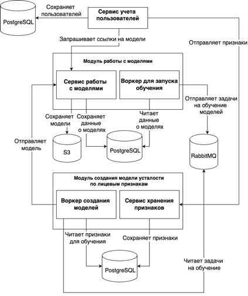
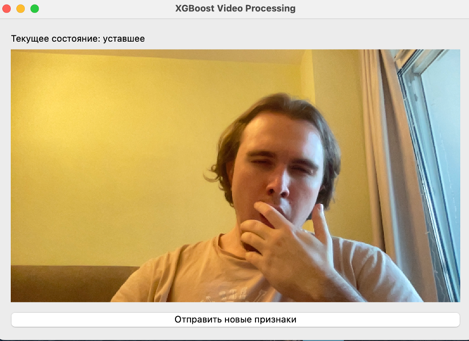

# fatigue-detection-system

Для запуска необходим предустановленный docker и docker-compose, а также утилита make

Инструкция для запуска:
1. Клонируйте репозиторий 
2. Из корневой папки пропишите команду
```
make start-full-containers
```

Документация сервисов:
* [Сервис учета пользователей](./user_data_service/docs/docs.md)
* [Сервис работы с моделями](./model_handler_service/docs/docs.md)
* [Сервис хранения лицевых признаков](./face_features_storage/docs/docs.md)

Архитектура системы:



[Пользовательский сценарий](./docs/user_scenario.md)

Пример работы приложения:


