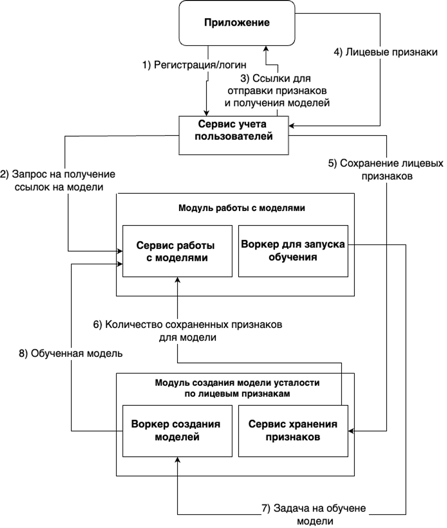

# Пользовательский сценарий

1) На первом этапе пользователь производит регистрацию и отправляет запрос на вход в систему;
2) Во время входа в сервисе пользователей производится авторизация и делается запрос на получение ссылок на скачивание моделей, которые пока не обучены;
3) Пользователю отправляются ссылки с встроенным JWT токеном на загрузку различных признаков;
4) Пользовательское приложение периодически отправляет признаки по предоставленным ссылкам;
5) В случае успешной авторизации признаки перенаправляются в соответствующие сервисы для их хранения, в моем случае в сервис хранения лицевых признаков;
6) Сервис хранения признаков отправляет информацию об их количестве сервису работы с моделями;
7) Периодически запускается воркер для запуска обучения и проверяет, набралось ли количество признаков превышающие порог обучения, если да, то отправляем задачу на обучение модели в соответствующую очередь RabbitMQ, иначе переходим к шагу 4;
8) Воркер создания моделей читает задачу с указанием пользовательского идентификатора, после чего считывает строки признаков данного пользователя и обучает на них модель.
9) Далее он отправляет модель на сохранение в сервис работы с моделями, где она сохраняется в S3 подобное хранилище.
